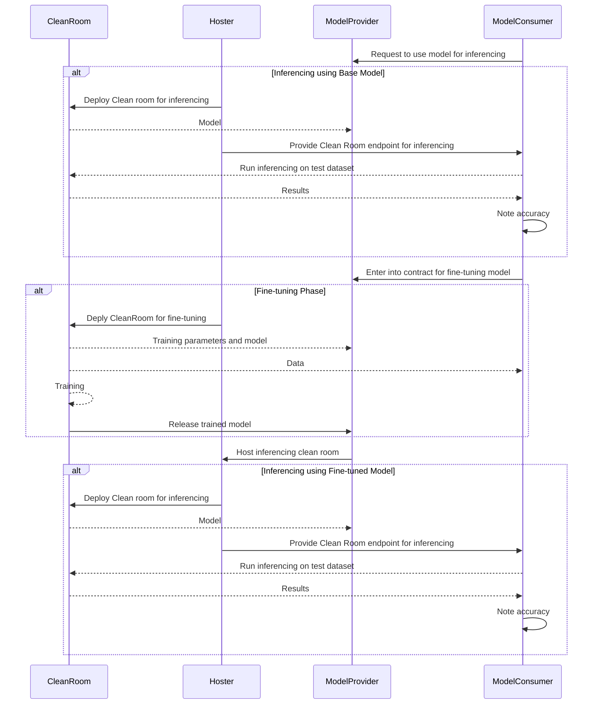

# Scenario

The sample uses a pre-trained model (https://huggingface.co/docs/transformers/model_doc/distilbert) for sentiment analysis on a movie-review dataset (https://huggingface.co/datasets/cornell-movie-review-data/rotten_tomatoes).

The proposed workflow is as follows:
1. There are three personas - hoster, model-provider and the model-consumer.
2. The model consumer wants to use the model by the provider for some inferencing. The hoster is the party that will host the model for inferencing in a clean room.
3. The model consumer runs the inferencing client on their "test" dataset and notes down the accuracy of the model.
4. The model comsumer and the model provider enter into a contract to improve the accuracy of the model by fine-tuning it on the data of the consumer.
5. The hoster then provides the training code, the consumer brings the data and the provider brings in the training parameters and the model.
6. The trained model is then released to the model-provider.
7. The hoster can then host the inferencing clean room, which the consumer can use for inferencing.



# For initial inference

> [!NOTE]
> The steps henceforth assume that the collaboration has been set up as listed [here](../../README.md#5-setup-the-consortium), but with three personas - hoster, model-publisher and model-consumer instead of just two as described.
>

### Model publisher brings the model for inference
```powershell
$publisherConfig = "./demo-resources/model-provider/provider-config/inference"
az cleanroom config init --cleanroom-config $publisherConfig
```

```powershell
$publisherResourceGroup = "model-publisher-$((New-Guid).ToString().Substring(0, 8))-${env:USER}"

# Download the pre-trained model from huggingface hub. We will download the distilbert-base model.
pip install -r ./model-provider/model/requirements.txt
python3 ./model-provider/model/get_model.py -output-path ./demo-resources/model-provider/model

# Create storage account, KV and MI resources.
$result = (../../prepare-resources.ps1 -resourceGroup $publisherResourceGroup -kvType akvpremium -outDir ./demo-resources/model-provider)

# Create a KEK entry in the configuration.
az cleanroom config set-kek `
    --kek-key-vault $result.kek.kv.id `
    --maa-url $result.maa_endpoint `
    --cleanroom-config $publisherConfig

# Create a datasource entry in the configuration.
az cleanroom config add-datasource `
    --cleanroom-config $publisherConfig `
    --name inference-model `
    --storage-account $result.sa.id `
    --identity $result.mi.id `
    --dek-key-vault $result.dek.kv.id

# Encrypt and upload content.
az cleanroom datasource upload `
    --cleanroom-config $publisherConfig `
    --name inference-model `
    --dataset-folder ./demo-resources/model-provider/model/onnx

az cleanroom config set-logging `
    --cleanroom-config $publisherConfig `
    --storage-account $result.sa.id `
    --identity $result.mi.id `
    --dek-key-vault $result.dek.kv.id

az cleanroom config set-telemetry `
    --cleanroom-config $publisherConfig `
    --storage-account $result.sa.id `
    --identity $result.mi.id `
    --dek-key-vault $result.dek.kv.id
```

### Hoster brings the inference container that hosts the model.
```powershell
$hosterConfig = "./demo-resources/hoster/hoster-config/inference"
az cleanroom config init --cleanroom-config $hosterConfig

az cleanroom config set-network-policy `
    --allow-all `
    --cleanroom-config $hosterConfig

$inferencingServerImage = "cleanroomsamples.azurecr.io/inferencing-server"
az cleanroom config add-application `
    --cleanroom-config $hosterConfig `
    --name inferencing-server `
    --image $inferencingServerImage `
    --command "python3 ./app/host_model.py --model-path=/mnt/remote/models" `
    --mounts "src=inference-model,dst=/mnt/remote/models" `
    --ports 8000 `
    --cpu 1 `
    --memory 3
```

### Propose the cleanroom contract

```powershell
az cleanroom config view `
    --cleanroom-config $hosterConfig `
    --configs $publisherConfig > ./demo-resources/cleanroom-config

$data = Get-Content -Raw ./demo-resources/cleanroom-config
$contractId = "inference-initial"
az cleanroom governance contract create `
    --data "$data" `
    --id $contractId `
    --governance-client "hoster-client"

$version = (az cleanroom governance contract show `
        --id $contractId `
        --query "version" `
        --output tsv `
        --governance-client "hoster-client")

az cleanroom governance contract propose `
    --version $version `
    --id $contractId `
    --governance-client "hoster-client"

$contract = (az cleanroom governance contract show `
        --id $contractId `
        --governance-client "hoster-client" | ConvertFrom-Json)

# Accept it.
az cleanroom governance contract vote `
    --id $contractId `
    --proposal-id $contract.proposalId `
    --action accept `
    --governance-client "hoster-client"
```

### Vote as publisher

```powershell
$contract = (az cleanroom governance contract show `
        --id $contractId `
        --governance-client "publisher-client" | ConvertFrom-Json)

# Accept it.
az cleanroom governance contract vote `
    --id $contractId `
    --proposal-id $contract.proposalId `
    --action accept `
    --governance-client "publisher-client"
```

### Vote as consumer
```powershell
$contract = (az cleanroom governance contract show `
        --id $contractId `
        --governance-client "consumer-client" | ConvertFrom-Json)

# Accept it.
az cleanroom governance contract vote `
    --id $contractId `
    --proposal-id $contract.proposalId `
    --action accept `
    --governance-client "consumer-client"
```

### Propose deployment spec and policy as hoster

```powershell
$outdir = "./demo-resources"
mkdir -p $outDir/deployments
az cleanroom governance deployment generate `
    --contract-id $contractId `
    --governance-client "hoster-client" `
    --output-dir $outDir/deployments

az cleanroom governance deployment template propose `
    --template-file $outDir/deployments/cleanroom-arm-template.json `
    --contract-id $contractId `
    --governance-client "hoster-client"

az cleanroom governance deployment policy propose `
    --policy-file $outDir/deployments/cleanroom-governance-policy.json `
    --contract-id $contractId `
    --governance-client "hoster-client"

az cleanroom governance ca propose-enable `
    --contract-id $contractId `
    --governance-client "hoster-client"
```

### Vote on the policy, template and ca

```powershell
$clientNames = @("publisher-client", "hoster-client", "consumer-client")

foreach ($clientName in $clientNames) {
    # Vote on the proposed deployment template.
    $proposalId = az cleanroom governance deployment template show `
        --contract-id $contractId `
        --governance-client $clientName `
        --query "proposalIds[0]" `
        --output tsv

    az cleanroom governance proposal vote `
        --proposal-id $proposalId `
        --action accept `
        --governance-client $clientName

    # Vote on the proposed cce policy.
    $proposalId = az cleanroom governance deployment policy show `
        --contract-id $contractId `
        --governance-client $clientName `
        --query "proposalIds[0]" `
        --output tsv

    az cleanroom governance proposal vote `
        --proposal-id $proposalId `
        --action accept `
        --governance-client $clientName

    # Vote on the proposed CA enable.
    $proposalId = az cleanroom governance ca show `
        --contract-id $contractId `
        --governance-client $clientName `
        --query "proposalIds[0]" `
        --output tsv

    az cleanroom governance proposal vote `
        --proposal-id $proposalId `
        --action accept `
        --governance-client $clientName
}
```

### Generate CA cert
```powershell
az cleanroom governance ca generate-key `
    --contract-id $contractId `
    --governance-client "hoster-client"

## Get the CA Cert as the consumer
az cleanroom governance ca show `
    --contract-id $contractId `
    --governance-client "consumer-client" `
    --query "caCert" `
    --output tsv > $outDir/deployments/cleanroomca.crt
```

### Setup access for publisher
```powershell
az cleanroom config wrap-deks `
    --contract-id $contractId `
    --cleanroom-config $publisherConfig `
    --governance-client "publisher-client"

pwsh ../../setup-access.ps1 `
    -resourceGroup $publisherResourceGroup `
    -contractId $contractId  `
    -outDir ./demo-resources/model-provider `
    -kvType akvpremium `
    -governanceClient "publisher-client"
```

### Deploy the cleanroom
```powershell
(az cleanroom governance deployment template show `
    --contract-id $contractId `
    --governance-client "hoster-client" `
    --query "data") | Out-File "./demo-resources/deployments/aci-deployment-template.json"
$cleanRoomName = "inference-cleanroom-initial"
az deployment group create `
    --resource-group $hosterResourceGroup `
    --name $cleanRoomName `
    --template-file "./demo-resources/deployments/aci-deployment-template.json"

$ccrIP = az container show `
        --name $cleanRoomName `
        -g $hosterResourceGroup `
        --query "ipAddress.ip" `
        --output tsv
Write-Host "Clean Room IP address: $ccrIP"
```

### Model consumer does inferencing
```powershell
$caCert = "$outDir/deployments/cleanroomca.crt"
$base64CaCert = $(cat $caCert | base64 -w 0)
docker stop ccr-client-proxy 1>$null 2>$null
docker rm ccr-client-proxy 1>$null 2>$null
docker run `
    --name ccr-client-proxy `
    -d `
    --add-host=ccr.cleanroom.local:${ccrIP} `
    -p 10080:10080 `
    -e CA_CERT=$base64CaCert `
    ccr-client-proxy `
    /bin/bash -c ./bootstrap.sh

bash $root/src/scripts/wait-for-it.sh --timeout=20 --strict 127.0.0.1:10080 -- echo "ccr-client-proxy is available"
Start-Sleep -Seconds 5

cd ./model-consumer/inferencing-client/
python3 ./inferencing-client.py --dataset-path ../input/rotten_tomatoes/ --inference-url  http://ccr.cleanroom.local:8000/infer
```

The above command gives the following output:
```
Output:
INFO:host-model-for-inferencing:Total rows in dataset: 1066
INFO:host-model-for-inferencing:Total number of succesful predictions: 520
INFO:host-model-for-inferencing:Success percentage: 48.78048780487805
```

# Training the model

### Model publisher brings the model for training and sets the datasink for output
```powershell
$publisherConfig = "./demo-resources/model-provider/provider-config/training"
az cleanroom config init --cleanroom-config $publisherConfig
```

```powershell
# Create storage account, KV and MI resources.
$result = (../../prepare-resources.ps1 -resourceGroup $publisherResourceGroup -kvType akvpremium -outDir ./demo-resources/model-provider)

# Create a KEK entry in the configuration.
az cleanroom config set-kek `
    --kek-key-vault $result.kek.kv.id `
    --maa-url $result.maa_endpoint `
    --cleanroom-config $publisherConfig

# Create a datasource entry in the configuration.
az cleanroom config add-datasource `
    --cleanroom-config $publisherConfig `
    --name training-model `
    --storage-account $result.sa.id `
    --identity $result.mi.id `
    --dek-key-vault $result.dek.kv.id

# Encrypt and upload content.
az cleanroom datasource upload `
    --cleanroom-config $publisherConfig `
    --name training-model `
    --dataset-folder ./demo-resources/model-provider/model/pytorch

az cleanroom config add-datasource `
    --cleanroom-config $publisherConfig `
    --name training-config `
    --storage-account $result.sa.id `
    --identity $result.mi.id `
    --dek-key-vault $result.dek.kv.id

# Encrypt and upload content.
az cleanroom datasource upload `
    --cleanroom-config $publisherConfig `
    --name training-config `
    --dataset-folder ./model-provider/training_config

az cleanroom config add-datasink `
    --cleanroom-config $publisherConfig `
    --name training-output `
    --storage-account $result.sa.id `
    --identity $result.mi.id `
    --dek-key-vault $result.dek.kv.id

az cleanroom config set-logging `
    --cleanroom-config $publisherConfig `
    --storage-account $result.sa.id `
    --identity $result.mi.id `
    --dek-key-vault $result.dek.kv.id

az cleanroom config set-telemetry `
    --cleanroom-config $publisherConfig `
    --storage-account $result.sa.id `
    --identity $result.mi.id `
    --dek-key-vault $result.dek.kv.id
```

### Model consumer brings the data to train the model.
```powershell
$consumerConfig = "./demo-resources/model-consumer/consumer-config/training"
az cleanroom config init --cleanroom-config $consumerConfig

$consumerResourceGroup = "model-consumer-$((New-Guid).ToString().Substring(0, 8))-${env:USER}"

$result = (../../prepare-resources.ps1 -resourceGroup $consumerResourceGroup -kvType akvpremium -outDir ./demo-resources/model-consumer)

# Create a KEK entry in the configuration.
az cleanroom config set-kek `
    --kek-key-vault $result.kek.kv.id `
    --maa-url $result.maa_endpoint `
    --cleanroom-config $consumerConfig

# Create a datasource entry in the configuration.
az cleanroom config add-datasource `
    --cleanroom-config $consumerConfig `
    --name training-data `
    --storage-account $result.sa.id `
    --identity $result.mi.id `
    --dek-key-vault $result.dek.kv.id

# Encrypt and upload content.
az cleanroom datasource upload `
    --cleanroom-config $consumerConfig `
    --name training-data `
    --dataset-folder ./model-consumer/input/rotten_tomatoes
```

### Hoster brings the training container that trains the model.
```powershell
$hosterConfig = "./demo-resources/hoster-config/training"
az cleanroom config init --cleanroom-config $hosterConfig

$trainingContainerImage = "cleanroomsamples.azurecr.io/ml-fine-tuning-training"
az cleanroom config add-application `
    --cleanroom-config $hosterConfig `
    --name fine-tuning `
    --image $trainingContainerImage `
    --command "python3 ./app/trainer.py --model-path=/mnt/remote/models --dataset-path=/mnt/remote/data --training-arguments-path /mnt/remote/training_config --output-path /mnt/remote/output"`
    --mounts "src=training-model,dst=/mnt/remote/models" "src=training-data,dst=/mnt/remote/data" "src=training-config,dst=/mnt/remote/training_config" "src=training-output,dst=/mnt/remote/output" `
    --cpu 1 `
    --memory 3
```

### Hoster creates the cleanroom config and propose the contract.

```powershell
az cleanroom config view `
    --cleanroom-config $hosterConfig `
    --configs $publisherConfig $consumerConfig  > ./demo-resources/training-config

$data = Get-Content -Raw ./demo-resources/training-config
$contractId = "training-initial"
az cleanroom governance contract create `
    --data "$data" `
    --id $contractId `
    --governance-client "hoster-client"

$version = (az cleanroom governance contract show `
        --id $contractId `
        --query "version" `
        --output tsv `
        --governance-client "hoster-client")

az cleanroom governance contract propose `
    --version $version `
    --id $contractId `
    --governance-client "hoster-client"

$contract = (az cleanroom governance contract show `
        --id $contractId `
        --governance-client "hoster-client" | ConvertFrom-Json)

# Accept it.
az cleanroom governance contract vote `
    --id $contractId `
    --proposal-id $contract.proposalId `
    --action accept `
    --governance-client "hoster-client"
```

### Vote as publisher

```powershell
$contract = (az cleanroom governance contract show `
        --id $contractId `
        --governance-client "publisher-client" | ConvertFrom-Json)

# Accept it.
az cleanroom governance contract vote `
    --id $contractId `
    --proposal-id $contract.proposalId `
    --action accept `
    --governance-client "publisher-client"
```

### Vote as consumer
```powershell
$contract = (az cleanroom governance contract show `
        --id $contractId `
        --governance-client "consumer-client" | ConvertFrom-Json)

# Accept it.
az cleanroom governance contract vote `
    --id $contractId `
    --proposal-id $contract.proposalId `
    --action accept `
    --governance-client "consumer-client"
```

### Propose deployment spec and policy as hoster

```powershell
$outdir = "./demo-resources"
mkdir -p $outDir/training/deployments
az cleanroom governance deployment generate `
    --contract-id $contractId `
    --governance-client "hoster-client" `
    --security-policy-creation-option allow-all `
    --output-dir $outDir/training/deployments

az cleanroom governance deployment template propose `
    --template-file $outDir/training/deployments/cleanroom-arm-template.json `
    --contract-id $contractId `
    --governance-client "hoster-client"

az cleanroom governance deployment policy propose `
    --policy-file $outDir/training/deployments/cleanroom-governance-policy.json `
    --contract-id $contractId `
    --governance-client "hoster-client"
```

### Vote on the policy, template

```powershell
$clientNames = @("publisher-client", "hoster-client", "consumer-client")

foreach ($clientName in $clientNames) {
    # Vote on the proposed deployment template.
    $proposalId = az cleanroom governance deployment template show `
        --contract-id $contractId `
        --governance-client $clientName `
        --query "proposalIds[0]" `
        --output tsv

    az cleanroom governance proposal vote `
        --proposal-id $proposalId `
        --action accept `
        --governance-client $clientName

    # Vote on the proposed cce policy.
    $proposalId = az cleanroom governance deployment policy show `
        --contract-id $contractId `
        --governance-client $clientName `
        --query "proposalIds[0]" `
        --output tsv

    az cleanroom governance proposal vote `
        --proposal-id $proposalId `
        --action accept `
        --governance-client $clientName
}
```

### Setup access for publisher
```powershell
az cleanroom config wrap-deks `
    --contract-id $contractId `
    --cleanroom-config $publisherConfig `
    --governance-client "publisher-client"

pwsh ../../setup-access.ps1 `
    -resourceGroup $publisherResourceGroup `
    -contractId $contractId  `
    -outDir ./demo-resources/model-provider `
    -kvType akvpremium `
    -governanceClient "publisher-client"
```

### Setup access for consumer
```powershell
az cleanroom config wrap-deks `
    --contract-id $contractId `
    --cleanroom-config $consumerConfig `
    --governance-client "consumer-client"

pwsh ../../setup-access.ps1 `
    -resourceGroup $consumerResourceGroup `
    -contractId $contractId  `
    -outDir ./demo-resources/model-consumer `
    -kvType akvpremium `
    -governanceClient "consumer-client"
```

### Deploy the cleanroom
```powershell
(az cleanroom governance deployment template show `
    --contract-id $contractId `
    --governance-client "hoster-client" `
    --query "data") | Out-File "./demo-resources/training/deployments/aci-deployment-template.json"
$cleanRoomName = "training-cleanroom-initial-3"
az deployment group create `
    --resource-group $hosterResourceGroup `
    --name $cleanRoomName `
    --template-file "./demo-resources/training/deployments/aci-deployment-template.json"
```

Run the following script to wait for the cleanroom to exit.
```powershell
../../wait-for-cleanroom.ps1 -cleanRoomName $cleanRoomName -resourceGroup $hosterResourceGroup
```

You can download the output once trained and use the trained onnx model for inferencing again.